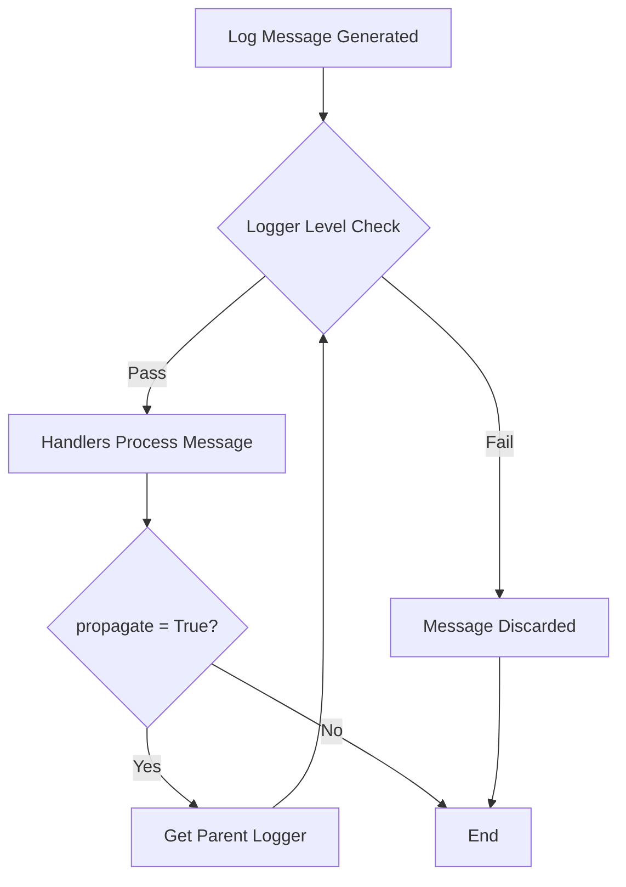

# Logging in Python
## Notes 
Root logger is the highest level logger.
- It is created with levele WARNING
- By default has `StreamHandler` that outputs to `sys.stderr`

Even when using named loggers, it is good to configure the root logger using `logging.basicConfig()`

When a logger is created, the level is set to NOTSET. If a logger has a level of NOTSET, its chain of ancestor loggers is traversed until either an ancestor with a level other than NOTSET is found, or the root is reached.

When a logger is called e.g `logger.info(...)`, the logger first checks if it has any handlers, if no handlers are found, the logger traverses its ancestor loggers unitl it reaches one with handlers or reaches the root logger.

Loggers should never be instantiated directly but always through the module-level function `logging.geLogger(name)`.

Low level (child) loggers forward messages to higher-level (parents/ancestors).
- This approach is known as hierarchical logging.
- Messages are forwarded to higher level loggers only if the logging level and filters at the child logger are satisfied.
- Can be disabled by setting the `propagate` property of the logger to false e.g `logger.propagate=False`.

### Logger level and handler level
The logger's level acts as primary filter. It determines which log messages are even considered for processing by the logger's ahndlers. If a log message's level is below the logger's level, it is discarded immediately.

The handler's level acts as a secondary filter. It determines which log messages, after passign the logger's filter are actually emiited by that specific handler. If a log message's level is below the handler's level, it is ignored by that handler.

### Logger Hierarchy
Loggers are organized in a hierarchical namespace using dot-separated names. e.g., given `myapp.module.submodule`, `myapp` is a parent of `myapp.module` and `myapp.module` is a child of `myapp`.

The root logger (named `''`) is the ultimate parent of all loggers.
### Propagation
propagation is the mechanism by which log messages are passed from a logger to its parent loggers in the logger hierarchy.

**Process**
1. A log messaged is generated when a logging method (e.g. `logger.infoo()`) is called.
2. The logger's level is checked. If the message's level is below the logger's level, the message is discarded otherwise it is passed to the logger's handlers.
3. Each handler performs its own level filtering and formatting.
4. After the logger handlers have processed the message, the logger's propagate attribute is checked. If `propagate` is `True` (the default), the message is passed to the logger's parent logger.
5. The parent logger repeats steps 2-4. This process continues up the hierarchy until the roort logger is reached or a logger with `propagate` set to `False` is encountered.

## Configuration
### using dictionary - `logging.config.dictConfig`
It is the preffered method for complex logging setups and logging in production systems because it is more flexible and maintainable.

Lambda functions can not be used directly in `dictConfig()` because it relies on pickling which does support lambdas. Work around is to use `eval()` - though it is less safe.

`disable_existing_loggers` set to `False` prevents existing loggers from being disabled, which is generally good practice.
